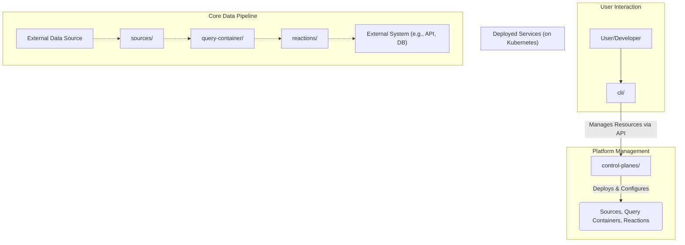

# AGENTS.md: Drasi Platform

## 1. High-Level Overview

-   **Purpose**: Drasi is a platform for building real-time, change-driven systems using continuous queries.
-   **Architecture**: Polyglot microservices system designed for Kubernetes.
-   **Core Technologies**: Rust (backend), Go (CLI), Dapr (inter-service communication).
-   **Repository**: `https://github.com/drasi-project/drasi-platform/`.
-   **Contribution Workflow**: Fork repo, commit to your fork and submit pull request.

### Architectural Flow Diagram

This diagram shows two primary flows: management (solid lines) and data pipeline (dashed lines).

## 2. Critical Development Notes

### **Git Submodule: `drasi-core`**

The `query-container/query-host` service depends on the `drasi-core` git submodule. Before building the `query-container`, the submodule **must** be initialized. Other components (`reactions`, `sources`, `control-planes`) can be built without it.

-   **Location**: `query-container/query-host/drasi-core/`
-   **Source Repository**: `https://github.com/drasi-project/drasi-core`
-   **Initialization Command**: `git submodule update --init --recursive`

Failure to initialize will cause compilation errors in `query-container`. For details on the engine, see the `README.md` within the submodule directory.

### **Data Contracts: `typespec/`**

The `typespec/` directory is the **single source of truth** for all inter-service data contracts.

-   **DO NOT** edit generated model files elsewhere.
-   All data model changes **must** be made in the source `.tsp` files.
-   After editing `.tsp` files, run the full generation workflow:
    1.  `npm install && npm run build` (in `typespec/`).
    2.  Run `quicktype` commands (defined in component `Makefile`s) to generate language-specific code from the updated JSON Schema.

Failure to follow this workflow will cause data contract mismatches.

## 3. Component Directory Guide

-   **`cli/`**: Go CLI (`drasi`) for platform installation and management.
-   **`control-planes/`**: Rust backend. Contains the `mgmt_api` and the `kubernetes_provider`.
-   **`query-container/`**: Rust microservices for the continuous query execution environment (`publish-api`, `query-host`, `view-svc`).
-   **`reactions/`**: Rust microservices that act on query results. Contains built-in reactions and SDKs.
-   **`sources/`**: Rust microservices that ingest data from external systems. Contains built-in sources and SDKs.
-   **`typespec/`**: Source of truth for all data contracts.
-   **`e2e-tests/`**: Jest/TypeScript end-to-end tests.

## 4. Build and Test

The root `Makefile` provides top-level targets for the primary development workflows:
-   **`make docker-build`**: Builds all container images for the platform.
-   **`make test`**: Runs the test suites for all components.
-   **`make lint-check`**: Performs all code quality and lint checks.

For local Kubernetes workflows, `make kind-load` and `make k3d-load` are available to load built images into a cluster.

The build system uses a recursive `make` structure. The root `Makefile` delegates targets (e.g., `docker-build`, `test`) to Makefiles in component subdirectories (`control-planes/`, `query-container/`, etc.), which in turn delegate to their own subdirectories. This orchestrates a full repository build from the top down.

## 5. Core Architecture & Runtime

-   **Pluggable Resource Providers**: The control plane is platform-agnostic. The `mgmt_api` communicates with a resource provider via a shared contract (`resource_provider_api`). The `kubernetes_provider` is the current implementation, translating Drasi resources into Kubernetes objects. This design allows for future platform providers.

-   **Dapr Integration**: Dapr is a mandatory dependency for the backend, handling all inter-service communication (Pub/Sub) and resource lifecycle management (Dapr Actors). `drasi init` installs Dapr if needed.

-   **Deployment Modes**:
    -   **Kubernetes**: The standard deployment target. `drasi init` installs into the current `kubectl` context.
    -   **Docker**: `drasi init --docker` provides a self-contained environment using a K3d (Kubernetes in Docker) cluster.

-   **User Workflow**:
    1.  Deploy the platform using `drasi init`.
    2.  Define `Source`, `ContinuousQuery`, and `Reaction` resources in YAML.
    3.  Deploy and manage resources using `drasi apply -f <file>.yaml`.