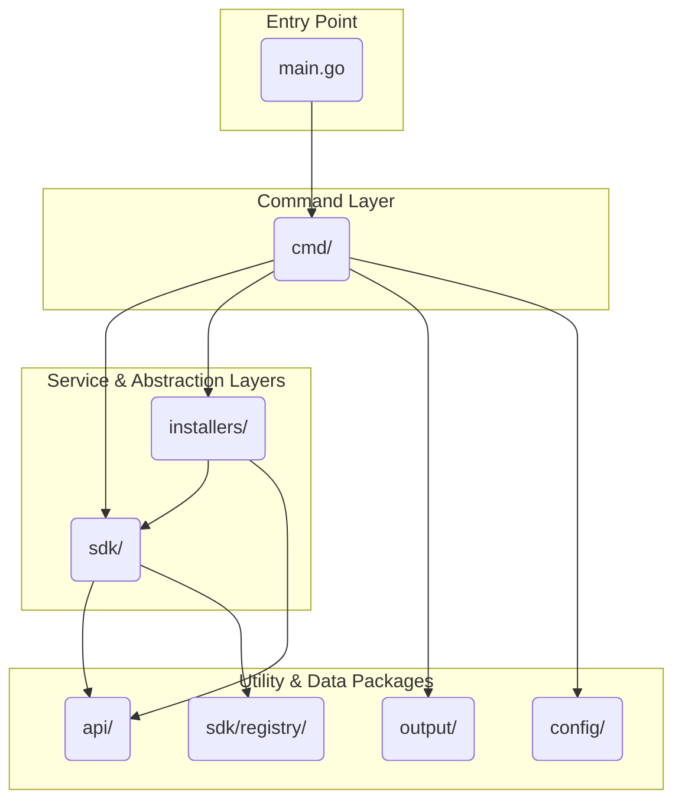

# AGENTS.md: Drasi CLI

This document provides a high-level overview of the Drasi Command Line Interface (CLI) project for coding agents. The CLI is a Go application built with the Cobra library, responsible for installing and managing Drasi environments and resources.

The `README.md` file contains additional context intended for human developers. For a detailed command reference, use the CLI's built-in `help` command (e.g., `drasi help apply`).

## Core Workflow

A typical command execution follows this flow:
1.  The user runs a command defined in the **`cmd/`** directory.
2.  The command uses the **`sdk/`** to get a `PlatformClient` for the target environment.
3.  The `PlatformClient` establishes a connection (e.g., a Kubernetes port-forward) and provides an `ApiClient`.
4.  The command uses the `ApiClient` to make HTTP calls to the Drasi Management API.
5.  Throughout the process, the **`output/`** package is used to render status and results to the user's terminal.

## Component Diagram

This diagram shows the structural dependencies between the major packages in the CLI.



## Project Structure

The CLI's functionality is organized into the following key directories. Each contains a local `AGENTS.md` file for more detailed information.

-   **`api/`**: Defines the core Go structs (`Manifest`, `Resource`) that represent Drasi resources in YAML files and in API communications. This is the foundational data model for the CLI.
-   **`cmd/`**: Contains the implementation for every user-facing command (e.g., `drasi apply`, `drasi init`). This is the entry point for all CLI functionality and orchestrates calls to the `sdk` and `installers`.
-   **`config/`**: Defines and initializes global, build-time variables like `Version` and `Registry`.
-   **`installers/`**: Holds the logic for installing and uninstalling Drasi environments. It abstracts platform specifics (Kubernetes vs. Docker) and contains the embedded YAML manifests for deployment in its `resources/` subdirectory.
-   **`output/`**: Manages all terminal output. It provides a rich, interactive UI for terminals and falls back to plain-text logging for non-interactive environments.
-   **`sdk/`**: The core abstraction layer. It provides a `PlatformClient` to handle environment-specific operations (like port-forwarding in Kubernetes) and an `ApiClient` to communicate with the Drasi Management API.

## Key Abstractions

-   **`sdk.PlatformClient`**: An interface that decouples the CLI commands from the underlying platform (e.g., Kubernetes). Implementations handle tasks like creating API clients, managing tunnels, and interacting with the platform's secret store. See `sdk/platform_client.go`.
-   **`installers.Installer`**: An interface for the multi-step process of deploying a Drasi environment. The `KubernetesInstaller` is the primary implementation. See `installers/installer.go`.
-   **`output.TaskOutput`**: An interface for rendering progress to the user, with implementations for rich terminal UIs and simple log output. See `output/interface.go`.

## Build and Test

The project is built using Go and a `Makefile`.

-   **Build for all platforms**:
    ```bash
    make
    ```
-   **Build for the current platform**:
    ```bash
    make build
    ```
-   **Install a local build**:
    ```bash
    # macOS / Linux
    sudo make install

    # Windows (in an elevated terminal)
    make install
    ```
-   **Formatting and Linting**:
    ```bash
    make fmt
    make vet
    ```
