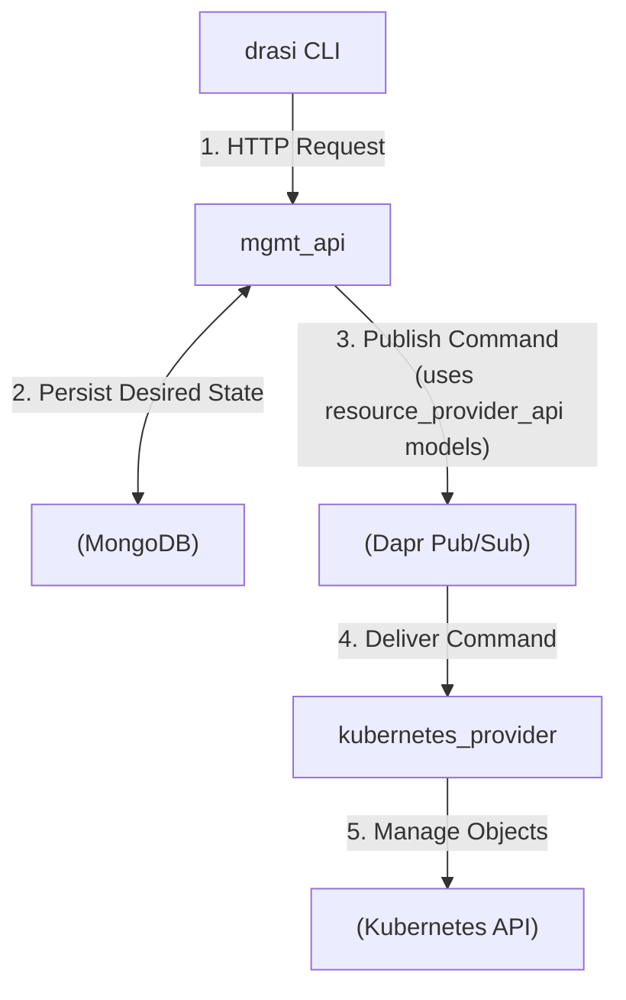

# AGENTS.md: `control-planes` Directory

This directory contains the source code for the Drasi platform's backend, known as the Control Plane.

## Architectural Context

-   **Role**: Drasi Platform Backend / Control Plane.
-   **Purpose**: Manages the complete lifecycle of all Drasi resources (Sources, Queries, Reactions).
-   **Architecture**: A pluggable microservices system built on the Kubernetes Controller pattern.
-   **Communication**: Dapr is used for all inter-service communication (e.g., pub/sub).

## Component Breakdown

The control plane is composed of three primary Rust projects:

-   **`mgmt_api/`**: The central orchestrator. It exposes the public API, receives commands from the `drasi` CLI, manages the desired state of resources in MongoDB, and delegates implementation tasks to providers.
    -   **For more details, see the `AGENTS.md` file within this subdirectory.**

-   **`kubernetes_provider/`**: The implementer for the Kubernetes platform. It subscribes to commands from the `mgmt_api` and translates abstract Drasi resources into concrete Kubernetes objects (`Deployment`, `Service`, etc.).
    -   **For more details, see the `AGENTS.md` file within this subdirectory.**

-   **`resource_provider_api/`**: A shared library crate that defines the communication contract (data models) used between the `mgmt_api` and any provider. It is not a running service.
    -   **For more details, see the `AGENTS.md` file within this subdirectory.**

## Control Flow Diagram

This diagram illustrates the typical workflow for creating a resource.



## Development

The top-level `Makefile` provides scripts to build the Docker images for the services.

-   **Build `mgmt_api` image**:
    ```bash
    make build-api
    ```
-   **Build `kubernetes_provider` image**:
    ```bash
    make build-provider
    ```
