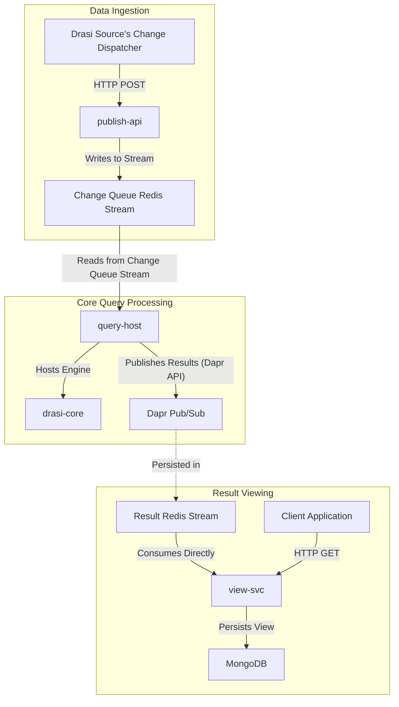

# AGENTS.md: `query-container`

## 1. Purpose & Architectural Intent

This directory contains the **Query Container**, a set of Rust microservices providing the core runtime environment for executing Drasi's continuous queries.

**Core Intent**: To provide a scalable, stateful, and resilient host for the `drasi-core` query engine. It manages the complete lifecycle of a continuous query, from data ingestion and processing to publishing results and maintaining a queryable view.

**Key Technologies**:
-   **Rust**: For performance and reliability.
-   **Dapr**: Used for the actor model, which provides stateful, addressable instances for each query.
-   **Redis Streams**: The primary mechanism for ordered, reliable data ingestion into the query engine.
-   **MongoDB**: The persistent backend for the `view-svc` to store and serve materialized query results.

## 2. Component Interaction Diagram

## 3. Component Directory Guide

-   **`publish-api/`**: A stateless service providing an HTTP endpoint for data ingestion. It receives data from Drasi Sources (`Change Dispatcher` component) and publishes it to a Redis Stream for consumption by the `query-host`.

-   **`query-host/`**: A Dapr-enabled service that hosts and executes continuous queries. It uses the Dapr actor model to manage the lifecycle of each query as a stateful, addressable entity. It consumes data from Redis, processes it using the embedded `drasi-core` engine, and publishes results via Dapr Pub/Sub.

-   **`view-svc/`**: A service that materializes and serves the results of continuous queries. It consumes the result stream directly from Redis (underlying the Dapr topic), stores the data in MongoDB using a temporal model, and exposes an HTTP API for clients to query the current or historical state of a view.

## 4. Build and Test

The top-level `Makefile` orchestrates the build for all services in this workspace. It delegates targets (`docker-build`, `test`, `lint-check`) to the `Makefile` in each subdirectory.