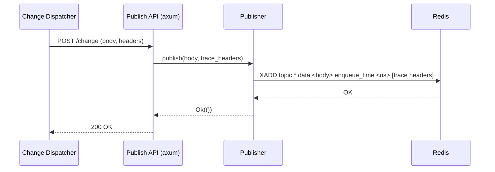

# AGENTS.md

Publish-API is an `axum` web-service that receives data via HTTP and publishes it to a Redis stream. It is invoked by the `Change Dispatcher` component of Drasi `Source`s.

## Key Files
-   **`main.rs`**: Entry point. Configures the Axum server, handles environment variables, and defines the HTTP route handlers.
-   **`publisher.rs`**: A lightweight wrapper around the `redis` client. It handles the connection and the `XADD` command to append messages to the stream.

## Configuration
Reads the following environment variables. Exits if `QUERY_NODE_ID` is missing.
-   `QUERY_NODE_ID`: Used to determine the Redis topic name.
-   `REDIS_BROKER`: Connection string (default: `redis://drasi-redis:6379`).
-   `PORT`: HTTP listening port (default: `4000`).

## Functionality
1.  **Publisher Initialization**: Connects to Redis and targets the topic `{QUERY_NODE_ID}-publish`.
2.  **HTTP Endpoints**:
    -   `/change`: Handles incoming change events (POST).
    -   `/data`: Handles generic incoming data (POST).
3.  **Publishing Logic**: Publishes the request body to the Redis stream using `XADD`. It enriches the message with:
    -   `data`: The raw request body.
    -   `enqueue_time`: Current timestamp in nanoseconds.
    -   `traceparent` & `tracestate`: Distributed tracing headers from the request (if present).

## Mermaid Diagram

