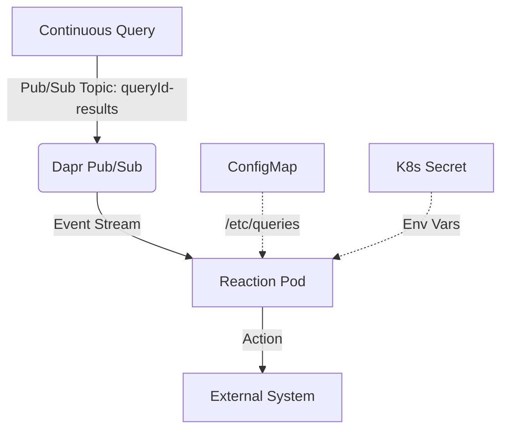

# AGENTS.md: Drasi Reactions

> For conceptual overview, YAML examples, and identity types, see [README.md](./README.md).

## 1. Deployment Orchestration Flow

Applying a `Reaction` manifest triggers this flow:

1.  **Submission**: CLI sends manifest to Management API (`PUT /v1/reactions/{id}`).
2.  **Validation**: API validates `spec.properties` against the `ReactionProvider.config_schema`.
3.  **Delegation**: API invokes the Dapr Actor `ReactionResource/{id}/configure` on the `kubernetes_provider`.
4.  **Resource Generation**: Provider creates Kubernetes resources:
    -   `Deployment`: The reaction pod.
    -   `ConfigMap`: Query subscriptions (mounted at `/etc/queries`).
    -   `Service`: Internal cluster networking.
    -   `Ingress`: Created **only** if endpoints are marked `external`.
    -   `Dapr Component`: Configures the `pubsub.redis` subscription.

## 2. Runtime Environment

The container receives configuration via:

-   **Environment Variables**:
    -   All key-value pairs from `spec.properties`.
    -   `PubsubName`: Dapr component name for subscriptions (e.g., `drasi-pubsub-{reaction-id}`).
    -   `INSTANCE_ID`: Unique identifier for this reaction instance.
-   **Filesystem**: `spec.queries` map mounted at `/etc/queries/{query-id}`.

## 3. Development

-   **SDKs**: Located in `reactions/sdk/`. Available in multiple languages.
-   **Build Commands** (from `reactions/` directory):
    -   `make docker-build`: Build Docker images for all reactions.
    -   `make kind-load`: Load images into local Kind cluster.
    -   `make test`: Run unit tests.
    -   `make lint-check`: Run linting checks.
