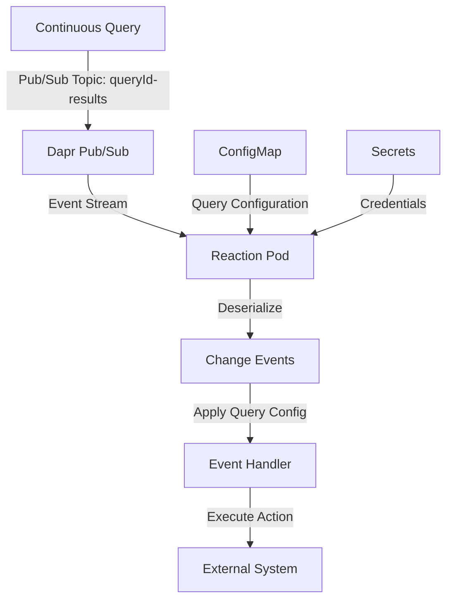

# Drasi Reactions

Reactions are a core component of the Drasi platform. They process the real-time stream of result changes (adds, updates, deletes) generated by one or more Continuous Queries and execute actions based on them. The action taken depends on the specific Reaction implementation.

## 1. Architectural Role

-   **Position in Pipeline**: Reactions are the final stage in the Drasi data processing pipeline: **Sources -> Continuous Queries -> Reactions**.
-   **Core Function**: They are event-driven microservices that subscribe to the real-time stream of changes from Continuous Queries and execute actions on external systems.
-   **Responsibilities**:
    -   **Integration**: Act as a bridge between Drasi and external systems (e.g., message brokers, databases, APIs).
    -   **Action**: Execute business logic based on query result changes.
    -   **Decoupling**: Separate the change detection logic (the "what" in a query) from the action logic (the "how" in a reaction).

## 2. Core Concepts: `ReactionProvider` vs. `Reaction`

The architecture separates a reaction's *type definition* from its *instance configuration* using two resource types.

### `ReactionProvider`
-   **Role**: Type Definition / Template.
-   **Purpose**: A control-plane-level resource that registers a **type** of reaction with the Drasi control plane. It serves as a template and validation schema for all reactions of its kind.
-   **Defines**:
    -   Container image for the reaction's implementation.
    -   Default Dapr settings and service configurations.
    -   A **`config_schema` (JSON Schema)** which serves as a validation contract for all `Reaction` instances of this type. The `mgmt_api` enforces this schema during creation and updates.

### `Reaction`
-   **Role**: Instance / Configured Deployment.
-   **Purpose**: A specific, configured instance of a `ReactionProvider`. This is the running microservice pod.
-   **Defines**:
    -   A reference (`kind`) to its `ReactionProvider`.
    -   Specific `properties` (e.g., connection strings) that conform to the provider's `config_schema`.
    -   The list of `queries` it subscribes to.

---

## 3. Resource Configuration and Examples

### `ReactionProvider` Resource

A `ReactionProvider` defines a *type* of reaction. It acts as a template, defining the container image, default settings, and a validation schema for its properties.

#### `ReactionProvider` Example

This example defines a hypothetical `WebhookNotifier` reaction provider.

```yaml
apiVersion: v1
kind: ReactionProvider
# (Required) A unique name for this type of reaction.
# This is the value that Reaction instances will reference in their `spec.kind` field.
name: WebhookNotifier
spec:
  # (Required) Defines the containerized services that make up this reaction.
  # While multiple services are supported, most reactions have a single service named "reaction".
  services:
    reaction:
      # (Required) The container image for the reaction's implementation.
      # The tag is optional and defaults to "latest".
      image: drasi-project/reaction-webhook:1.2.0

      # (Optional) If true, the 'image' path is used exactly as provided.
      # If false or omitted, the system prepends its default container registry path.
      external_image: false

      # (Optional) If true, the control plane will call a 'deprovision' method on the
      # reaction's Dapr actor upon deletion, allowing for graceful cleanup before termination.
      deprovision_handler: true

      # (Optional) Dapr sidecar configuration for this service.
      dapr:
        # The port on the reaction container that the Dapr sidecar should communicate with.
        app-port: "8080"
        # The protocol Dapr should use (e.g., "http", "grpc").
        app-protocol: "http"

      # (Optional) Defines the network ports the reaction container exposes.
      # Multiple endpoints are supported.
      endpoints:
        # A unique name for the endpoint.
        gateway:
          # The port number to expose on the container.
          target: "8080"
          # The exposure setting. "internal" creates a Kubernetes ClusterIP Service.
          # "external" creates both a ClusterIP Service and an Ingress resource.
          setting: internal
        metrics:
          target: "9090"
          setting: internal

  # (Optional) Schema that defines the contract for the `properties`
  #     section of any Reaction instance of this type.
  #     The `mgmt_api` uses this to validate Reaction resources.
  config_schema:
    type: object
    properties:
      # Defines a mandatory 'url' property.
      url:
        type: string
        description: "The webhook URL to send notifications to."
      # Defines an optional 'apiKey' property.
      apiKey:
        type: string
        description: "The API key for authenticating with the webhook endpoint."
      # Defines an optional 'retries' property with a default value.
      retries:
        type: number
        description: "The number of times to retry a failed webhook call."
        default: 3
    required:
      - url
```

### `Reaction` Resource

A `Reaction` is a specific, configured instance of a `ReactionProvider`. It is the running microservice that subscribes to queries and executes actions.

#### Fully Annotated `Reaction` Example

This example creates an instance of the `WebhookNotifier` provider defined above.

```yaml
apiVersion: v1
kind: Reaction
# (Required) A unique name for this specific reaction instance.
name: customer-alerts-webhook
spec:
  # (Required) The 'name' of the ReactionProvider to use as a template.
  kind: WebhookNotifier

  # (Optional) Overrides the image tag from the ReactionProvider.
  # In this case, it would use "drasi-project/reaction-webhook:1.2.1" instead of "1.2.0".
  tag: "1.2.1"

  # (Optional) Overrides for the service definitions from the provider.
  services:
    reaction:
      # Overrides the default replica count from "1" to "2".
      replica: "2"

  # (Optional) Defines the identity the reaction pod should use to authenticate with
  # external services. See the "Identity Types" section below for all options.
  identity:
    kind: MicrosoftEntraWorkloadID
    clientId: "xxxxxxxx-xxxx-xxxx-xxxx-xxxxxxxxxxxx"

  # (Optional) Configuration properties for this specific instance.
  # These keys and values MUST conform to the `config_schema` in the ReactionProvider.
  # Each key-value pair is injected into the container as an environment variable.
  properties:
    url: "https://api.example.com/customer-alerts"
    retries: 5 # Overrides the default value of 3 from the provider schema.
    # Values can be sourced securely from Kubernetes Secrets.
    apiKey:
      kind: Secret
      name: webhook-credentials # The name of the Kubernetes Secret
      key: customer-api-key    # The key within the Secret

  # (Required) A map defining the Continuous Queries this reaction instance subscribes to.
  queries:
    # The key is the ID of the ContinuousQuery.
    high-value-customer-alert: |
      # The value is an optional YAML or JSON string containing configuration
      # specific to this query subscription. This content is made available
      # to the reaction pod in a volume-mounted file at /etc/queries/{query-id}.
      includeAdded: true
      minOrderValue: 1000
    churn-risk-detected:
```

---

## 4. Configuration Reference

### Identity Types (`spec.identity`)

The `identity` block configures how the reaction authenticates to external services.

| `kind` | Description | Fields |
| :--- | :--- | :--- |
| **`MicrosoftEntraWorkloadID`** | Uses Azure AD Workload Identity. | `clientId` |
| **`MicrosoftEntraApplication`**| Uses an Azure AD App Registration. | `tenantId`, `clientId`, `secret` (or `certificate`) |
| **`ConnectionString`** | A generic connection string. | `connectionString` |
| **`AccessKey`** | A generic access key. | `accessKey` |
| **`AwsIamRole`** | Uses an AWS IAM Role. | `roleArn` |
| **`AwsIamAccessKey`** | Uses AWS IAM access keys. | `accessKeyId`, `secretAccessKey`, `region` |

*Note: All fields within the `identity` block can reference Kubernetes Secrets in the same way as the `properties` block.*

### Configuration at Runtime

A running reaction container accesses its configuration via two mechanisms:

-   **Environment Variables**: All key-value pairs from the `spec.properties` section of the `Reaction` manifest are injected as environment variables. Values from Kubernetes Secrets are securely resolved and injected.
-   **Volume-Mounted Files**: The `spec.queries` map is stored in a `ConfigMap` and mounted as a file volume at `/etc/queries`.

### Reaction Runtime Data Flow

This diagram illustrates the data flow *inside* a running Reaction pod.



---

## 5. Developing Custom Reactions

Drasi provides SDKs to simplify the development of custom reactions. SDKs for various languages are available in the `reactions/sdk/` directory.
