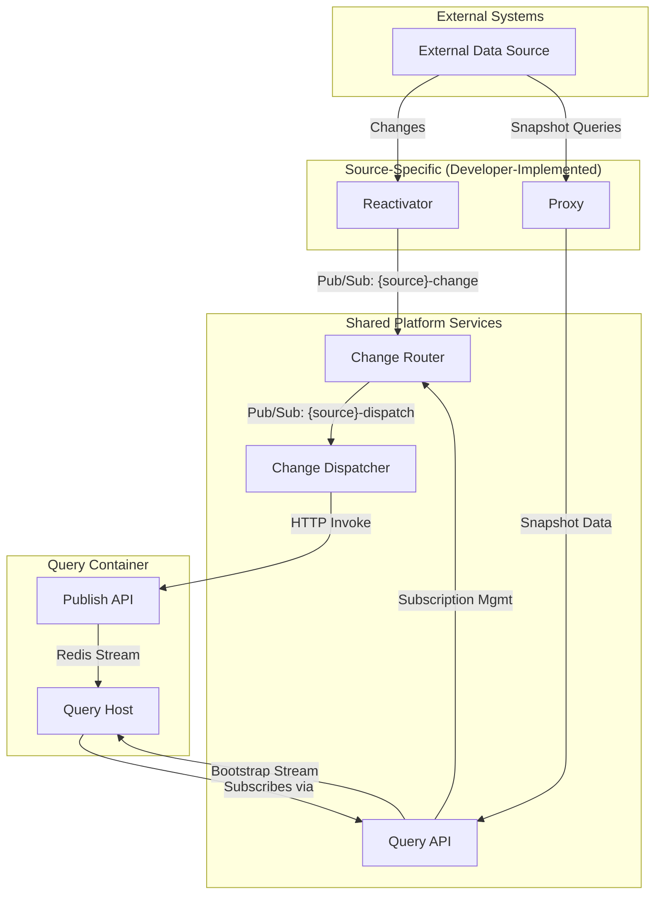

# Drasi Sources

Sources are a core component of the Drasi platform. They provide connectivity to the external systems that Drasi observes for data changes, acting as the entry point for all information flowing into the platform.

## 1. Architectural Role

-   **Position in Pipeline**: Sources are the first stage in the Drasi data processing pipeline: **Sources -> Continuous Queries -> Reactions**.
-   **Core Function**: They are microservice-based connectors that perform Change Data Capture (CDC) on external systems.
-   **Responsibilities**:
    -   **Connectivity**: Establish and maintain a connection to an external data source (e.g., a database, an API, a message queue).
    -   **Change Detection**: Continuously monitor the source for `INSERT`, `UPDATE`, and `DELETE` operations.
    -   **Data Transformation**: Translate the source's native data model into Drasi's internal property graph model (nodes and relationships). This allows disparate data sources to be queried together seamlessly.
    -   **Bootstrapping**: Provide a complete initial snapshot of the relevant source data when a new Continuous Query starts, ensuring it has the correct initial state before processing live changes.

## 2. Core Concepts: `SourceProvider` vs. `Source`

The architecture separates a source's *type definition* from its *instance configuration* using two resource types.

### `SourceProvider`
-   **Role**: Type Definition / Template.
-   **Purpose**: A control-plane-level resource that registers a **type** of source with the Drasi control plane. It serves as a template and validation schema for all sources of its kind.
-   **Defines**:
    -   Container images for the source's implementation services (the `reactivator` and `proxy`).
    -   Default Dapr settings and service configurations.
    -   A **`config_schema` (JSON Schema)** which serves as a validation contract for all `Source` instances of this type. The `mgmt_api` enforces this schema during creation and updates.

### `Source`
-   **Role**: Instance / Configured Deployment.
-   **Purpose**: A specific, configured instance of a `SourceProvider`. This is the running set of microservices that connects to a specific external system.
-   **Defines**:
    -   A reference (`kind`) to its `SourceProvider`.
    -   Specific `properties` (e.g., connection strings, tables to watch) that conform to the provider's `config_schema`.
    -   An optional `identity` block for securely authenticating to the external system.

---

## 3. Resource Configuration and Examples

### `SourceProvider` Resource

A `SourceProvider` defines a *type* of source. It acts as a template, defining the container images, default settings, and a validation schema for its properties.

#### `SourceProvider` Example

This example defines a hypothetical `ApiPoller` source provider that polls an HTTP API for changes.

```yaml
apiVersion: v1
kind: SourceProvider
# (Required) A unique name for this type of source.
# This is the value that Source instances will reference in their `spec.kind` field.
name: ApiPoller
spec:
  # (Required) Defines the containerized services that make up this source type.
  # Every source requires a 'reactivator' (for CDC) and a 'proxy' (for bootstrapping).
  services:
    reactivator:
      # (Required) The container image for the change detection logic.
      image: drasi-project/source-api-poller-reactivator:1.0.0

      # (Optional) If true, the 'image' path is used exactly as provided.
      # If false or omitted, the system prepends its default container registry path.
      externalImage: false

      # (Optional) If true, the control plane will call a 'deprovision' method on the
      # service's Dapr actor upon deletion, allowing for graceful cleanup before termination.
      deprovisionHandler: true

      # (Optional) Dapr sidecar configuration for this service.
      dapr:
        # The port on the container that the Dapr sidecar should communicate with.
        app-port: "8080"
        # The protocol Dapr should use (e.g., "http", "grpc").
        app-protocol: "http"

    proxy:
      # (Required) The container image for the data snapshot logic.
      image: drasi-project/source-api-poller-proxy:1.0.0

      # (Optional) Defines the network ports the container exposes.
      endpoints:
        # A unique name for the endpoint.
        api:
          # The port number to expose on the container.
          target: "8080"
          # The exposure setting. "Internal" creates a Kubernetes ClusterIP Service.
          # "External" creates both a ClusterIP Service and an Ingress resource.
          setting: Internal

  # (Optional) Schema that defines the contract for the properties
  # section of any Source instance of this type.
  # The `mgmt_api` uses this to validate Source resources.
  config_schema:
    type: object
    properties:
      # Defines a mandatory 'endpoint' property.
      endpoint:
        type: string
        description: "The base URL of the API to poll."
      # Defines a mandatory 'apiKey' property.
      apiKey:
        type: string
        description: "The API key for authentication."
      # Defines an optional 'pollIntervalSeconds' property with a default value.
      pollIntervalSeconds:
        type: number
        description: "The interval in seconds at which to poll the API."
        default: 60
      # Defines a mandatory 'resources' array.
      resources:
        type: array
        description: "A list of API resource paths to monitor (e.g., /users, /products)."
        items:
          type: string
    required:
      - endpoint
      - apiKey
      - resources
```

### `Source` Resource

A `Source` is a specific, configured instance of a `SourceProvider`. It is the running set of microservices that connects to one external data endpoint.

#### Fully Annotated `Source` Example

This example creates an instance of the `ApiPoller` provider defined above to monitor a specific CRM API.

```yaml
apiVersion: v1
kind: Source
# (Required) A unique name for this specific source instance.
name: crm-api-source
spec:
  # (Required) The 'name' of the SourceProvider to use as a template.
  kind: ApiPoller

  # (Optional) Defines the identity the source pods should use to authenticate with
  # external services. See the "Identity Types" section below for all options.
  identity:
    kind: MicrosoftEntraWorkloadID
    clientId: "xxxxxxxx-xxxx-xxxx-xxxx-xxxxxxxxxxxx"

  # (Required) Configuration properties for this specific instance.
  # These keys and values MUST conform to the config_schema in the SourceProvider.
  # Each key-value pair is injected into the service containers as an environment variable.
  properties:
    endpoint: "https://my-crm.example.com/api/v2"
    pollIntervalSeconds: 30 # Overrides the default value of 60 from the provider schema.
    resources:
      - "/customers"
      - "/invoices"
    # Values can be sourced securely from Kubernetes Secrets.
    apiKey:
      kind: Secret
      name: crm-api-credentials   # The name of the Kubernetes Secret
      key: api-key                # The key within the Secret
```

---

## 4. Configuration Reference

### Identity Types (`spec.identity`)

The `identity` block configures how the source authenticates to external services.

| `kind` | Description | Fields |
| :--- | :--- | :--- |
| **`MicrosoftEntraWorkloadID`** | Uses Azure AD Workload Identity. | `clientId` |
| **`MicrosoftEntraApplication`**| Uses an Azure AD App Registration. | `tenantId`, `clientId`, `secret` (or `certificate`) |
| **`ConnectionString`** | A generic connection string. | `connectionString` |
| **`AccessKey`** | A generic access key. | `accessKey` |
| **`AwsIamRole`** | Uses an AWS IAM Role. | `roleArn` |
| **`AwsIamAccessKey`** | Uses AWS IAM access keys. | `accessKeyId`, `secretAccessKey`, `region` |

*Note: All fields within the `identity` block can reference Kubernetes Secrets in the same way as the `properties` block.*

### Configuration at Runtime

A running source container accesses its configuration via environment variables. All key-value pairs from the `spec.properties` section of the `Source` manifest are injected as environment variables. Values from Kubernetes Secrets are securely resolved and injected.

### Source Runtime Data Flow

This diagram illustrates the data flow through a running Source and into the Query Container.



---

## 5. Developing Custom Sources

Drasi provides SDKs to simplify the development of custom sources. The core task for a developer is to implement two main components:

1.  **The Reactivator**: This service contains the logic for detecting changes in the source system (e.g., polling an API, subscribing to a message queue, reading a database transaction log).
2.  **The Proxy**: This service contains the logic for fetching a full snapshot of the data from the source system to initialize new queries.

The Drasi platform provides three additional shared services (`query-api`, `change-router`, `change-dispatcher`) that handle the complex work of routing change events and managing query subscriptions, allowing the developer to focus solely on the integration logic.

SDKs for various languages are available in the `sources/sdk/` directory.
