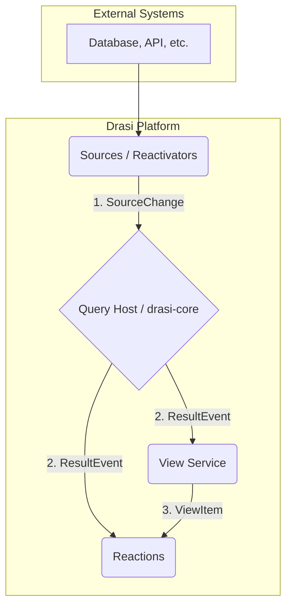

# AGENTS.md: `typespec` Directory

## 1. Architecture & Core Contracts

**This directory is the single source of truth for all data contracts governing the flow of information through the multiple components of the Drasi platform.**

**Note:** DO NOT EDIT GENERATED FILES - all data model changes **must** be made to the source `.tsp` files in this directory, followed by the generation workflow below.

-   **Core Technology**: TypeSpec
-   **Architectural Pattern**: Language-agnostic contracts via compilation to a universal JSON Schema.
-   **Goal**: Enforce type safety and consistency in a polyglot microservices system.
-   **Primary Data Flow**:



### Contract Model Breakdown

### `source-output` (`SourceChange`)
-   **Contract Type**: `INPUT`
-   **Role**: Standardized data change event from any external system.
-   **Context**: The lingua franca for all incoming data; Drasi Sources transform raw events (like Debezium CDC, Kubernetes API events) into this format.
-   **Producers**: `sources/sdk/*`, `sources/relational/debezium-reactivator`, `sources/kubernetes/kubernetes-reactivator`, etc.
-   **Consumers**: `query-container/query-host/drasi-core` (including all middleware).

### `query-output` (`ResultEvent`)
-   **Contract Type**: `PACKED OUTPUT`
-   **Role**: Represents the outcome of a continuous query evaluation in a batch format which contains arrays of `added`, `updated`, and `deleted` results.
-   **Context**: Efficient for consumers that can process arrays of added/updated/deleted results in a single message.
-   **Producers**: `query-container/query-host`.
-   **Consumers**: `reactions/sdk/*`, `query-container/view-svc`, `control-planes/mgmt_api` (for `drasi watch`).

### `output-unpacked` (`Notification`)
-   **Contract Type**: `STREAMING OUTPUT`
-   **Role**: An alternative, single-event output format for each individual change.
-   **Context**: Designed for real-time UIs (SignalR) or event-driven systems (Event Grid, EventBridge) that operate on discrete events.
-   **Producers**: The formatting logic within specific reactions.
-   **Consumers**: External systems via reactions like `reactions/signalr/signalr-reaction`, `reactions/azure/eventgrid-reaction`, `reactions/aws/eventbridge-reaction`.

### `view-svc` (`ViewItem`)
-   **Contract Type**: `RETRIEVAL`
-   **Role**: Represents a single row when fetching the full, materialized result set of a query.
-   **Context**: Used by consumers to bootstrap their state by loading the entire query result before processing live changes.
-   **Producers**: `query-container/view-svc`.
-   **Consumers**: `reactions/sdk/*` (specifically the `ResultViewClient`), `reactions/dapr/sync-statestore`.

## 2. Generation Workflow & Mandates

1.  **Modify the Source**: Edit the appropriate `.tsp` file in this directory.
2.  **Generate JSON Schema**: From the `typespec` directory, run the build script.
    ```bash
    npm install && npm run build
    ```
3.  **Generate Language-Specific Code**: Use **`quicktype`** to consume the newly created JSON Schema.

    **Example (Generating C#):**
    ```bash
    quicktype \
      --src-lang schema -l cs \
      -o ../reactions/sdk/dotnet/Drasi.Reaction.SDK/Models/QueryOutput/Models.generated.cs \
      ./query-output/_generated/@typespec/json-schema/*.yaml \
      --framework SystemTextJson --namespace Drasi.Reaction.SDK.Models.QueryOutput
    ```
-   **Canonical Reference**: The `Makefile`s in various projects (e.g., `reactions/sdk/dotnet/Makefile`) contain the exact `quicktype` commands and are the executable source of truth for this workflow.
-   **To add a new model**: Create or modify a `.tsp` file, then update the relevant build scripts (`Makefile`, etc.) to include the new `quicktype` generation step for all required languages.